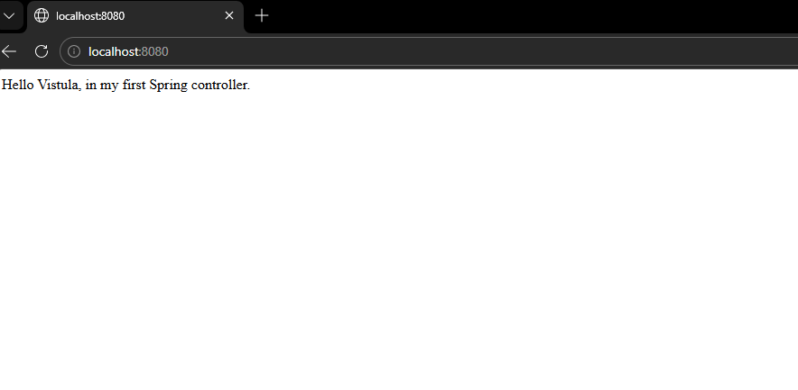
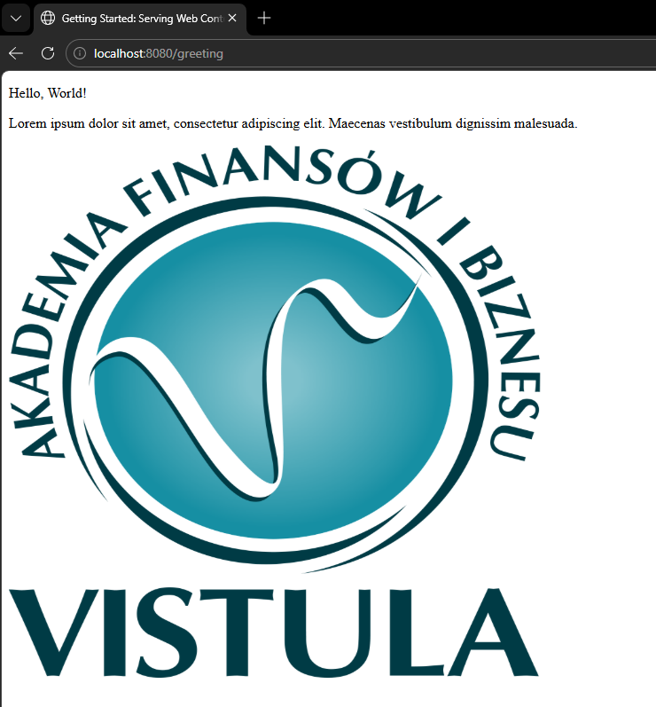

# First Project Java Spring
This project is the first task of the Spring Framework course. The goal was to create a web application from scratch using Spring Boot, implement a controller, and serve dynamic content using the Thymeleaf template engine.

## Technologies used
* **Java 21**
* **Spring Boot**
* **Thymeleaf**
* **Maven**

## How to Run the Web Application
1. Open in IDE: Import the project into IntelliJ IDEA;
2. Maven Sync: Right-click the project -> Maven -> Reload Project;
3. Launch: Run the main method in FirstProjectJavaSpringApplication.java;
4. URL: The app runs at "http://localhost:8080"

## Use cases
### 1. Root page
* **URL:** "http://localhost:8080/"
* **Description:**  Displays a plain text message returned directly by the controller.
* **Result:**
    
### 2. Greeting Page
* **URL:** "http://localhost:8080/greeting"
* **Description** This page displays a greeting using a Thymeleaf template.
* **Result:**
    